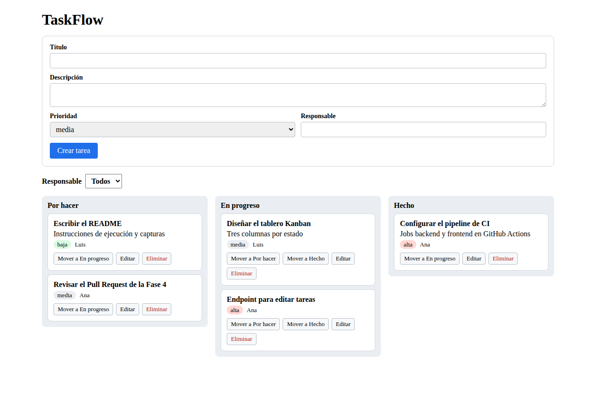
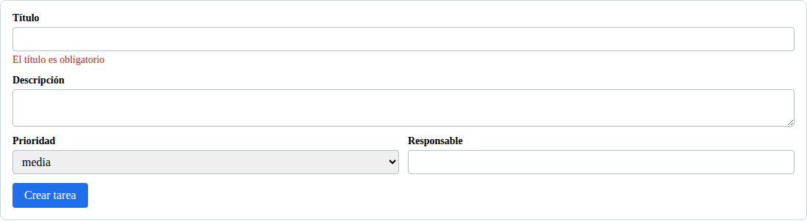
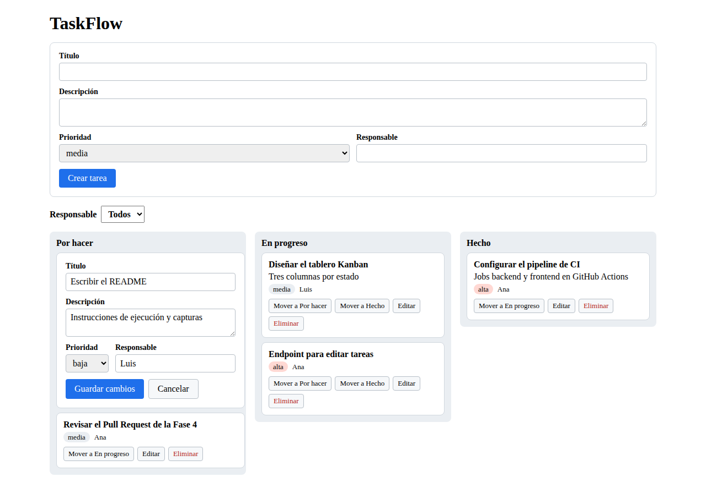
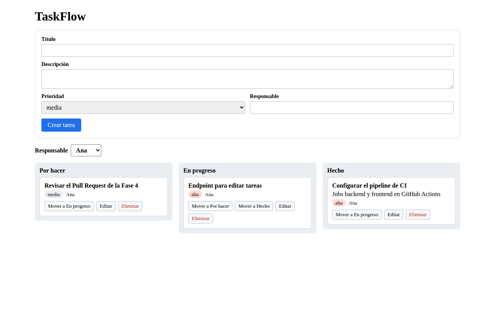
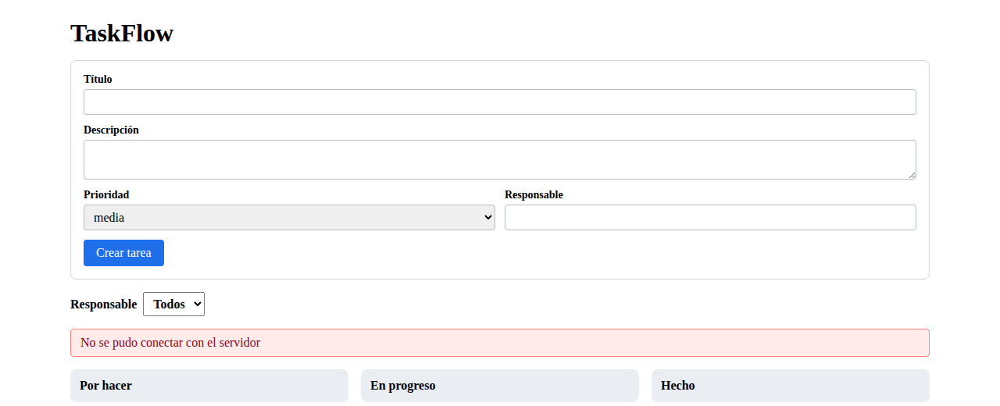

# TaskFlow — Desarrollo guiado por especificaciones con Angular y GitHub

Proyecto del Primer Parcial de **Programación Móvil**. Demuestra un modelo moderno de desarrollo de software
para una empresa ecuatoriana que pierde versiones de código, no organiza el trabajo en equipo, tiene errores
en producción y carece de documentación.

El sistema de ejemplo, **TaskFlow**, es un gestor de tareas con tablero Kanban hecho en **Angular** con una API
**Node.js/Express** y base de datos **SQLite**, desarrollado con **Spec Driven Development** usando la estructura
de **GitHub Spec Kit**.

## Cómo se resuelve cada problema de la empresa

| Problema | Solución aplicada en este repositorio |
|---|---|
| Pérdida de versiones del código | Git + GitHub, ramas `main` / `develop` / `feature/*` |
| Falta de organización en equipo | Issues, Projects (Kanban), Milestones y Pull Requests |
| Errores frecuentes en producción | TDD + pipeline de GitHub Actions que bloquea PR con pruebas fallidas |
| Falta de documentación técnica | Especificaciones SDD en `specs/` y flujo en `docs/` |
| Sin herramientas modernas | GitHub Actions, GitHub Copilot y GitHub Spec Kit |

## Capturas

| Tablero Kanban | Validación del formulario |
|---|---|
|  |  |

| Edición de una tarea | Filtro por responsable |
|---|---|
|  |  |

Si la API no está disponible, la interfaz lo avisa:



## Requisitos

- **Node.js 22 LTS** (versión del plan y del CI). También funciona con Node 24.
- npm (incluido con Node.js) y Git.
- No hace falta Visual Studio ni Python: `better-sqlite3` usa binarios precompilados
  (`backend/.npmrc` evita que npm intente compilarlo).

## Ejecución local

Clonar e instalar dependencias (una sola vez, o cuando cambien los `package-lock.json`):

```bash
git clone https://github.com/IamCris0/spec-driven-angular-github.git
cd spec-driven-angular-github
cd backend && npm ci && cd ..
cd frontend && npm ci && cd ..
```

Levantar la aplicación en **dos terminales**:

```bash
# Terminal 1: API REST en http://localhost:3000/api
cd backend
npm start          # o "npm run dev" para reiniciar al cambiar el código

# Terminal 2: frontend en http://localhost:4200
cd frontend
npx ng serve
```

La primera vez la API crea la base de datos en `backend/data/taskflow.db` (Git la ignora). Para empezar con el
tablero vacío, detén la API y borra ese archivo.

## Pruebas

```bash
cd backend
npm test                    # Jest + Supertest con SQLite en memoria

cd frontend
npx ng build                # compilación de producción
npx ng test --no-watch      # Vitest + jsdom, sin navegador
```

Son los mismos pasos que ejecuta el pipeline. Si una prueba falla en local, también fallará en el Pull Request.

## API REST

Base: `http://localhost:3000/api`

| Método | Ruta | Descripción | Respuestas |
|---|---|---|---|
| GET | `/tasks?assignee=Ana` | Lista tareas; el filtro es opcional | 200 |
| GET | `/tasks/:id` | Obtiene una tarea | 200, 404 |
| POST | `/tasks` | Crea una tarea | 201, 400 |
| PUT | `/tasks/:id` | Edita título, descripción, prioridad y responsable | 200, 400, 404 |
| PATCH | `/tasks/:id/status` | Cambia solo el estado | 200, 400, 404 |
| DELETE | `/tasks/:id` | Elimina una tarea | 204, 404 |

Los errores responden `{ "error": "mensaje" }`, por ejemplo `400 { "error": "El título es obligatorio" }`.

```bash
curl -X POST http://localhost:3000/api/tasks -H "Content-Type: application/json" -d "{\"title\":\"Probar API\",\"assignee\":\"Ana\"}"
curl -X PATCH http://localhost:3000/api/tasks/1/status -H "Content-Type: application/json" -d "{\"status\":\"en_progreso\"}"
curl "http://localhost:3000/api/tasks?assignee=Ana"
```

En PowerShell usa `curl.exe` en lugar de `curl`.

## Pipeline de CI/CD

[`.github/workflows/ci.yml`](.github/workflows/ci.yml) se ejecuta en cada `push` y `pull_request` hacia `main` y
`develop`:

| Job | Pasos | Cuándo |
|---|---|---|
| `backend` | `npm ci` → `npm test` | Siempre |
| `frontend` | `npm ci` → `ng build` → `ng test` | Siempre |
| `deploy` | build del frontend publicado como artefacto `taskflow-frontend` | Solo en push a `main`, con los dos anteriores en verde |

El deploy es simulado (el despliegue real está fuera de alcance): el build se descarga desde la pestaña
**Actions → run → Artifacts** y se puede servir con cualquier servidor de archivos estáticos.

## Problemas comunes

| Síntoma | Solución |
|---|---|
| `npx ng` pregunta por *analytics* | Responde `No`. Si respondes `Yes`, el CLI escribe un ID en `frontend/angular.json`: no lo subas al repositorio. |
| `EPERM` al instalar en Windows | OneDrive bloquea `node_modules`: pausa la sincronización o mueve el proyecto fuera de OneDrive (por ejemplo `C:\dev`). |
| `npm install` falla con `edgesOut` en el frontend | Usa `npm ci`, que respeta el `package-lock.json`. |
| Puerto 3000 o 4200 ocupado | Cierra el proceso anterior; el frontend espera la API en el puerto 3000. |
| La interfaz dice "No se pudo conectar con el servidor" | La API no está corriendo: inicia `npm start` en `backend/`. |

## Estructura

```text
.specify/memory/constitution.md   Principios del proyecto (Spec Kit)
specs/001-gestor-tareas/
├── spec.md                       Qué hace el sistema y por qué
├── plan.md                       Cómo se construye (tecnología, datos, API)
└── tasks.md                      Tareas ordenadas para implementar
docs/
├── flujo-de-trabajo.md           Ramas, commits, PR, code review y gestión
├── verificacion.md               Verificación de requisitos y criterios de éxito
└── capturas/                     Capturas de pantalla del README
backend/
├── src/                          app.js, server.js, db.js, tasks.repository.js, tasks.routes.js
└── tests/                        Pruebas de la API (Jest + Supertest)
frontend/src/app/
├── models/task.ts                Interfaz Task y tipos
├── services/task.service.ts      Cliente HTTP de la API
└── components/                   board, task-card, task-form
.github/workflows/                Pipeline CI/CD
```

## Flujo SDD aplicado

1. **Constitución** → [`constitution.md`](.specify/memory/constitution.md)
2. **Especificación** → [`spec.md`](specs/001-gestor-tareas/spec.md)
3. **Plan técnico** → [`plan.md`](specs/001-gestor-tareas/plan.md)
4. **Tareas** → [`tasks.md`](specs/001-gestor-tareas/tasks.md)
5. **Implementación** → ramas `feature/*` con Pull Requests

Detalle del flujo de trabajo: [`docs/flujo-de-trabajo.md`](docs/flujo-de-trabajo.md).

## Referencias

- GitHub. (s. f.). *Spec Kit*. https://github.com/github/spec-kit
- EDteam. (s. f.). *Spec Driven Development*. https://ed.team/cursos/sdd
- Spec Driven. (s. f.). https://specdriven.ai/
