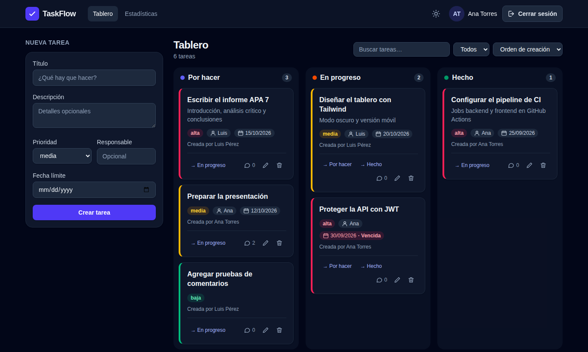
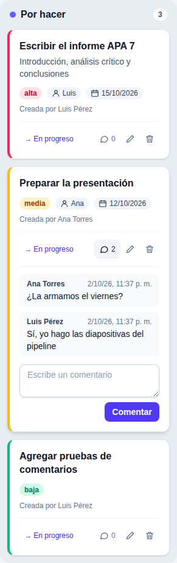
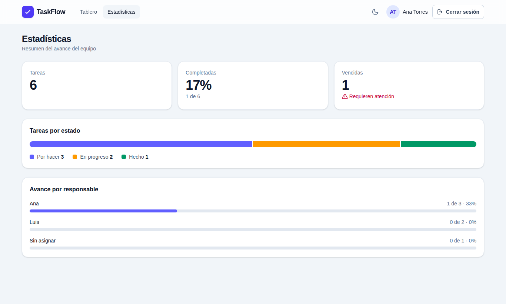
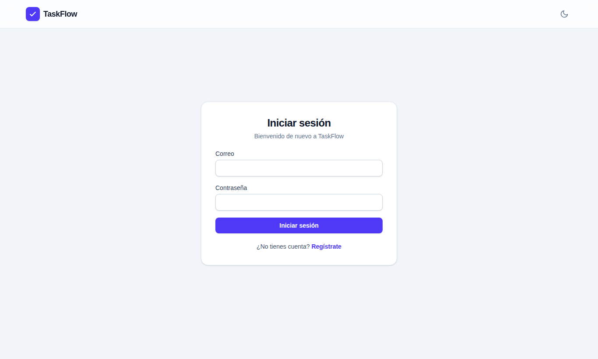
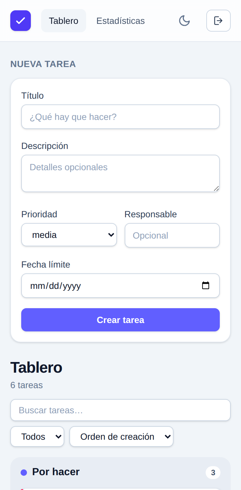

# TaskFlow — Desarrollo guiado por especificaciones con Angular y GitHub

Proyecto del Primer Parcial de **Programación Móvil**. Demuestra un modelo moderno de desarrollo de software
para una empresa ecuatoriana que pierde versiones de código, no organiza el trabajo en equipo, tiene errores
en producción y carece de documentación.

El sistema de ejemplo, **TaskFlow**, es un gestor de tareas con tablero Kanban hecho en **Angular** con una API
**Node.js/Express** y base de datos **SQLite**, desarrollado con **Spec Driven Development** usando la estructura
de **GitHub Spec Kit**.

## Funcionalidades

| Versión | Qué incluye | Especificación |
|---|---|---|
| v1 | Tablero Kanban con tres columnas, crear, editar, eliminar, mover entre estados y filtrar por responsable | [`001-gestor-tareas`](specs/001-gestor-tareas/spec.md) |
| v2 | Cuentas de usuario con inicio de sesión (JWT), autor de cada tarea, fecha límite y tareas vencidas, búsqueda, orden, arrastrar y soltar, comentarios, estadísticas, diseño con Tailwind CSS, modo oscuro y versión móvil | [`002-taskflow-v2`](specs/002-taskflow-v2/spec.md) |

**Seguridad**: contraseñas guardadas solo como hash bcrypt, tokens JWT que expiran en 8 horas, toda la API de
tareas y estadísticas exige sesión, el inicio de sesión no revela si el correo existe y se bloquea 15 minutos tras
5 intentos fallidos. Detalle en el [plan de la v2](specs/002-taskflow-v2/plan.md#seguridad).

## Cómo se resuelve cada problema de la empresa

| Problema | Solución aplicada en este repositorio |
|---|---|
| Pérdida de versiones del código | Git + GitHub, ramas `main` / `develop` / `feature/*` |
| Falta de organización en equipo | Issues, Projects (Kanban), Milestones y Pull Requests |
| Errores frecuentes en producción | TDD + pipeline de GitHub Actions que bloquea PR con pruebas fallidas |
| Falta de documentación técnica | Especificaciones SDD en `specs/` y flujo en `docs/` |
| Sin herramientas modernas | GitHub Actions, GitHub Copilot y GitHub Spec Kit |

## Capturas


| Modo oscuro | Comentarios de una tarea |
|---|---|
|  |  |

| Estadísticas | Inicio de sesión | Móvil |
|---|---|---|
|  |  |  |

## Requisitos

- **Node.js 22 LTS** (versión del plan y del CI). También funciona con Node 24.
- npm (incluido con Node.js) y Git.
- No hace falta Visual Studio ni Python: `better-sqlite3` usa binarios precompilados
  (`backend/.npmrc` evita que npm intente compilarlo).

## Ejecución local

Clonar e instalar dependencias (una sola vez, o cuando cambien los `package-lock.json`):

```bash
git clone https://github.com/IamCris0/spec-driven-angular-github.git
cd spec-driven-angular-github
cd backend && npm ci && cd ..
cd frontend && npm ci && cd ..
```

Levantar la aplicación en **dos terminales**:

```bash
# Terminal 1: API REST en http://localhost:3000/api
cd backend
npm start          # o "npm run dev" para reiniciar al cambiar el código

# Terminal 2: frontend en http://localhost:4200
cd frontend
npx ng serve
```

Abre http://localhost:4200, entra en **Regístrate** y crea tu cuenta: el tablero solo se ve con sesión iniciada.

La primera vez la API crea la base de datos en `backend/data/taskflow.db` (Git la ignora). Si ya tenías una base
de la v1, se actualiza sola al arrancar y conserva las tareas. Para empezar de cero, detén la API y borra ese
archivo.

### Clave de los tokens (`JWT_SECRET`)

Sin `JWT_SECRET`, la API usa una clave aleatoria en cada arranque: funciona, pero las sesiones se cierran al
reiniciar la API y la consola lo avisa. Para conservarlas, define la variable antes de `npm start`:

```bash
# PowerShell
$env:JWT_SECRET = "una-clave-larga-y-secreta"
# Git Bash, macOS o Linux
export JWT_SECRET="una-clave-larga-y-secreta"
```

Con `NODE_ENV=production` la API no arranca sin `JWT_SECRET`. Nunca subas la clave al repositorio.

## Pruebas

```bash
cd backend
npm test                    # Jest + Supertest con SQLite en memoria (154 pruebas)

cd frontend
npx ng build                # compilación de producción
npx ng test --no-watch      # Vitest + jsdom, sin navegador (135 pruebas)
```

Son los mismos pasos que ejecuta el pipeline. Si una prueba falla en local, también fallará en el Pull Request.

## API REST

Base: `http://localhost:3000/api`. Todas las rutas salvo `/auth/register` y `/auth/login` exigen la cabecera
`Authorization: Bearer <token>`.

| Método | Ruta | Descripción | Respuestas |
|---|---|---|---|
| POST | `/auth/register` | Crea una cuenta y devuelve `{ token, user }` | 201, 400, 409 |
| POST | `/auth/login` | Inicia sesión y devuelve `{ token, user }` | 200, 400, 401, 429 |
| GET | `/auth/me` | Usuario de la sesión | 200, 401 |
| GET | `/tasks?assignee=Ana&q=texto` | Lista tareas; filtro y búsqueda opcionales y combinables | 200, 401 |
| GET | `/tasks/:id` | Obtiene una tarea | 200, 401, 404 |
| POST | `/tasks` | Crea una tarea (`due_date` opcional, `AAAA-MM-DD`) | 201, 400, 401 |
| PUT | `/tasks/:id` | Edita título, descripción, prioridad, responsable y fecha límite | 200, 400, 401, 404 |
| PATCH | `/tasks/:id/status` | Cambia solo el estado | 200, 400, 401, 404 |
| DELETE | `/tasks/:id` | Elimina una tarea y sus comentarios | 204, 401, 404 |
| GET | `/tasks/:id/comments` | Comentarios de una tarea | 200, 401, 404 |
| POST | `/tasks/:id/comments` | Agrega un comentario `{ "body": "..." }` | 201, 400, 401, 404 |
| GET | `/stats` | Totales por estado, vencidas y avance por responsable | 200, 401 |

Los errores responden `{ "error": "mensaje" }`, por ejemplo `400 { "error": "El título es obligatorio" }`.

```bash
# 1. Crear una cuenta (o iniciar sesión con /auth/login) y copiar el "token" de la respuesta
curl -X POST http://localhost:3000/api/auth/register -H "Content-Type: application/json" -d "{\"name\":\"Ana\",\"email\":\"ana@taskflow.ec\",\"password\":\"secreta123\"}"

# 2. Usar el token en las demás peticiones
curl http://localhost:3000/api/tasks -H "Authorization: Bearer TU_TOKEN"
curl -X POST http://localhost:3000/api/tasks -H "Authorization: Bearer TU_TOKEN" -H "Content-Type: application/json" -d "{\"title\":\"Probar API\",\"due_date\":\"2026-10-31\"}"
```

En PowerShell usa `curl.exe` en lugar de `curl`.

## Pipeline de CI/CD

[`.github/workflows/ci.yml`](.github/workflows/ci.yml) se ejecuta en cada `push` y `pull_request` hacia `main` y
`develop`:

| Job | Pasos | Cuándo |
|---|---|---|
| `backend` | `npm ci` → `npm test` | Siempre |
| `frontend` | `npm ci` → `ng build` → `ng test` | Siempre |
| `deploy` | build del frontend publicado como artefacto `taskflow-frontend` | Solo en push a `main`, con los dos anteriores en verde |

El deploy es simulado (el despliegue real está fuera de alcance): el build se descarga desde la pestaña
**Actions → run → Artifacts** y se puede servir con cualquier servidor de archivos estáticos.

## Problemas comunes

| Síntoma | Solución |
|---|---|
| `npx ng` pregunta por *analytics* | Responde `No`. Si respondes `Yes`, el CLI escribe un ID en `frontend/angular.json`: no lo subas al repositorio. |
| `EPERM` al instalar en Windows | OneDrive bloquea `node_modules`: pausa la sincronización o mueve el proyecto fuera de OneDrive (por ejemplo `C:\dev`). |
| `npm install` falla con `edgesOut` en el frontend | Usa `npm ci`, que respeta el `package-lock.json`. |
| Puerto 3000 o 4200 ocupado | Cierra el proceso anterior; el frontend espera la API en el puerto 3000. |
| La interfaz dice "No se pudo conectar con el servidor" | La API no está corriendo: inicia `npm start` en `backend/`. |
| Te saca a la pantalla de inicio de sesión al reiniciar la API | Normal sin `JWT_SECRET`: defínela (ver arriba) o vuelve a iniciar sesión. |
| "Demasiados intentos, espera unos minutos" | 5 contraseñas incorrectas seguidas bloquean ese correo 15 minutos (o reinicia la API). |

## Estructura

```text
.specify/memory/constitution.md   Principios del proyecto (Spec Kit)
specs/
├── 001-gestor-tareas/            v1: spec.md, plan.md, tasks.md
└── 002-taskflow-v2/              v2: cuentas, diseño y productividad
docs/
├── flujo-de-trabajo.md           Ramas, commits, PR, code review y gestión
├── verificacion.md               Verificación de requisitos y criterios de éxito
└── capturas/                     Capturas de pantalla del README
backend/
├── src/
│   ├── app.js, server.js         Aplicación Express y punto de entrada
│   ├── db.js                     Conexión SQLite y migraciones
│   ├── auth.js                   Registro, inicio de sesión, JWT y límite de intentos
│   ├── tasks.routes.js           Rutas de tareas y comentarios
│   ├── stats.routes.js           Estadísticas
│   └── *.repository.js           Consultas SQL (tareas, usuarios, comentarios)
└── tests/                        Pruebas de la API (Jest + Supertest)
frontend/src/app/
├── models/                       Task, User y utilidades (vencidas, orden)
├── services/                     TaskService, AuthService, ThemeService
├── interceptors/, guards/        Token en cada petición y rutas protegidas
├── pages/                        login, register, stats
└── components/                   board, task-card, task-form, task-comments
.github/workflows/                Pipeline CI/CD
```

## Flujo SDD aplicado

1. **Constitución** → [`constitution.md`](.specify/memory/constitution.md)
2. **Especificación** → [v1](specs/001-gestor-tareas/spec.md) y [v2](specs/002-taskflow-v2/spec.md)
3. **Plan técnico** → [v1](specs/001-gestor-tareas/plan.md) y [v2](specs/002-taskflow-v2/plan.md)
4. **Tareas** → [v1](specs/001-gestor-tareas/tasks.md) y [v2](specs/002-taskflow-v2/tasks.md)
5. **Implementación** → ramas `feature/*` con Pull Requests

Detalle del flujo de trabajo: [`docs/flujo-de-trabajo.md`](docs/flujo-de-trabajo.md).

## Referencias

- GitHub. (s. f.). *Spec Kit*. https://github.com/github/spec-kit
- EDteam. (s. f.). *Spec Driven Development*. https://ed.team/cursos/sdd
- Spec Driven. (s. f.). https://specdriven.ai/
