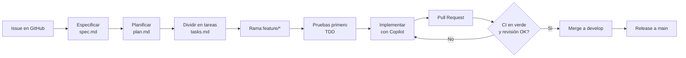
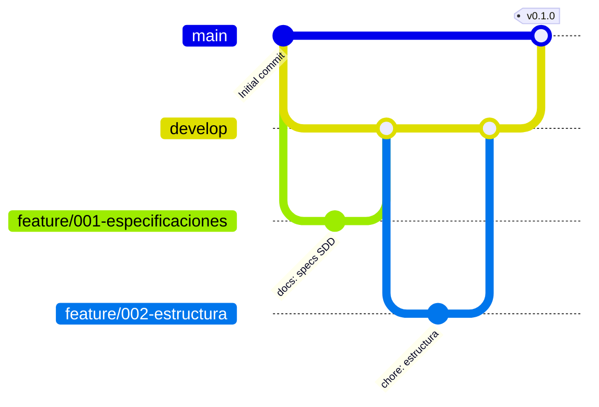

# Flujo de trabajo del equipo

Este documento describe cómo trabaja el equipo en el repositorio. Combina **Spec Driven Development (SDD)**,
**Git Flow simplificado**, **Pull Requests con revisión** y **CI con GitHub Actions**.

## 1. Ciclo de una funcionalidad



1. **Issue**: cada funcionalidad o error empieza como un Issue, asignado a un integrante y a un Milestone.
2. **Especificar** (`/speckit.specify`): se escribe *qué* y *por qué* en `specs/NNN-nombre/spec.md`.
3. **Planificar** (`/speckit.plan`): se decide *cómo* (tecnología, datos, API) en `plan.md`.
4. **Tareas** (`/speckit.tasks`): se divide el plan en tareas pequeñas en `tasks.md`.
5. **Implementar** (`/speckit.implement`): se programa en una rama, con pruebas primero.
6. **Pull Request**: el pipeline se ejecuta y el compañero revisa el código.
7. **Merge**: solo con pipeline en verde y al menos una aprobación.

## 2. Estrategia de ramas: Git Flow simplificado



| Rama | Propósito | ¿Quién escribe? |
|---|---|---|
| `main` | Código estable, listo para producción | Solo merges desde `develop` |
| `develop` | Integración de funcionalidades terminadas | Solo merges de PR |
| `feature/NNN-nombre` | Una funcionalidad de `tasks.md` | El integrante asignado |
| `fix/nombre` | Corrección de un error | El integrante asignado |
| `docs/nombre` | Solo documentación | Cualquiera |

**¿Por qué Git Flow y no Trunk Based?** Trunk Based Development (todos integran en `main` varias veces al día)
es ideal para equipos con mucha automatización y *feature flags*. Para un equipo que **está empezando** a
ordenar su proceso, como la empresa del caso, Git Flow simplificado da más control: `develop` actúa como zona de
pruebas y `main` siempre queda estable. Cuando la cobertura de pruebas sea alta, el equipo puede migrar a Trunk
Based.

## 3. Convención de commits

Se usa [Conventional Commits](https://www.conventionalcommits.org/es/):

```
feat: agrega endpoint para crear tareas
fix: corrige validación del título vacío
test: agrega pruebas de cambio de estado
docs: actualiza especificación del tablero
ci: agrega job de pruebas del frontend
chore: actualiza dependencias
```

## 4. Pull Requests y Code Review

Cada PR debe:
- Referenciar su Issue (`Closes #12`).
- Explicar qué cambia y cómo probarlo.
- Indicar si se usó IA (Copilot) y qué partes se revisaron manualmente.
- Tener el pipeline en verde.

Quien revisa verifica:
- [ ] El cambio cumple la especificación (`spec.md`).
- [ ] Hay pruebas para el comportamiento nuevo.
- [ ] El código es legible y no duplica lógica.
- [ ] No hay secretos, contraseñas ni archivos de base de datos en el commit.

## 5. Protección de ramas (configuración en GitHub)

En **Settings → Branches → Add rule** para `main` y `develop`:
- Require a pull request before merging (1 aprobación).
- Require status checks to pass (jobs `backend` y `frontend`).
- Do not allow bypassing the above settings.

## 6. Gestión del proyecto

- **Issues**: una por cada fase de `tasks.md`, con etiquetas `feature`, `bug`, `docs`, `ci`.
- **Projects (Kanban)**: columnas *Por hacer*, *En progreso*, *En revisión*, *Hecho*.
- **Milestones**: `v0.1 – Especificaciones`, `v0.2 – MVP`, `v1.0 – Entrega final`.
